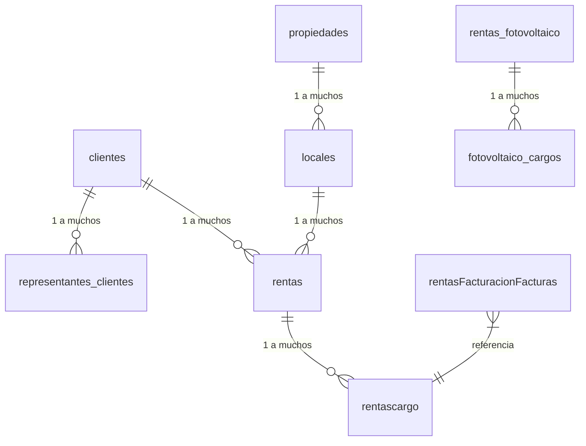

# Análisis del Concentrado de Rentas: Estructura de Base de Datos y Diseño de Data Warehouse

## 📌 **Descripción General**
El documento proporcionado describe la estructura de una base de datos para un sistema de gestión de rentas, con énfasis en propiedades, clientes, facturación, y módulos especializados como fotovoltaico. A continuación, se desglosa su arquitectura y relaciones.

---

## 🔍 **Análisis de Tablas y Relaciones**

### **Tablas Principales y sus Campos Clave**
| Tabla                        | Campo Clave           | Relaciones                                                                 |
|------------------------------|-----------------------|----------------------------------------------------------------------------|
| `clientes`                   | `id_cliente` (int)    | Relacionada con `representantes_clientes`, `rentas`, `fotovoltaico_facturas`. |
| `representantes_clientes`    | `id` (int)            | Enlazada a `clientes` mediante `id_cliente_moral`.                         |
| `propiedades`                | `id_propiedad` (int)  | Relacionada con `locales` y `rentas_fotovoltaico`.                         |
| `locales`                    | `id_local` (int)      | Vinculada a `propiedades` y `rentas`.                                      |
| `rentas`                     | `id_rentas` (int)     | Conexión con `clientes`, `propiedades`, `locales`, y tablas de facturación.|
| `rentas_fotovoltaico`        | `id_renta_fotovolt`   | Relacionada con `fotovoltaico_cargos`, `facturas_pagos_fotovolt`.          |

### **Módulos Especializados**
- **Facturación**:  
  Tablas como `rentasFacturacionFacturas`, `rentasFacturacionUUID`, y `fotovoltaico_facturas` gestionan folios, UUIDs, y pagos.
- **Fotovoltaico**:  
  Incluye tablas para lecturas (`fotovoltaico_lecturas_pdbt`), cargos (`fotovoltaico_cargos`), y complementos de pago (`cfdi_complementos_pagos_fotovolt`).

### **Diagrama Relacional Simplificado**


# 🧠 Análisis Exhaustivo del Concentrado de Rentas: Guía para Entender la Base de Datos

## **🔎 Introducción al Concentrado**
El archivo PDF muestra la estructura de una base de datos para un sistema de rentas inmobiliarias con módulos adicionales (como energía fotovoltaica). A primera vista parece un listado de tablas y campos, pero en realidad es un **mapa de relaciones complejas**. Vamos a descifrarlo capa por capa.

---

## **📚 Cómo Leer el Documento Paso a Paso**

### **1. Identificar las Tablas Principales**
Las tablas principales son las que **no dependen de otras** y suelen ser el punto de partida:
- `clientes`: Almacena información de quienes rentan.
- `propiedades`: Registra los inmuebles disponibles.
- `locales`: Detalles de espacios específicos (como departamentos o oficinas).
- `rentas`: El núcleo del sistema, donde se guardan los contratos de arrendamiento.

*Ejemplo:*  
Cada `renta` está vinculada a un `cliente` y a una `propiedad` (o `local`).

### **2. Entender las Relaciones (Claves Foráneas)**
Los campos como `id_cliente`, `id_propiedad`, o `id_renta` son **puentes** entre tablas. Hay dos tipos de relaciones:
- **1 a muchos** (1:*): Un cliente puede tener múltiples rentas.
- **0..1 a 1**: Opcional (ej: un representante *puede* no tener cliente asociado).

*Patrón típico:*  
```sql
-- Ejemplo de relación en SQL
SELECT * FROM rentas 
WHERE id_cliente = X; -- Todas las rentas de un cliente
