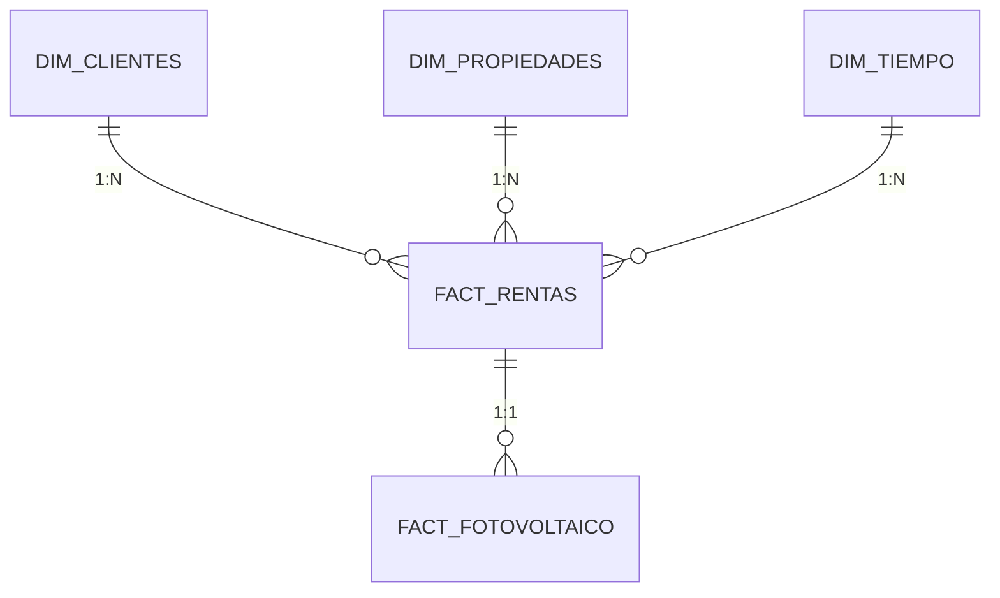

# Análisis del Concentrado de Rentas: Estructura de Base de Datos y Diseño de Data Warehouse

## 📌 **Descripción General**
El documento proporcionado describe la estructura de una base de datos para un sistema de gestión de rentas, con énfasis en propiedades, clientes, facturación, y módulos especializados como fotovoltaico. A continuación, se desglosa su arquitectura y relaciones.

---

## 🔍 **Análisis de Tablas y Relaciones**

### **Tablas Principales y sus Campos Clave**
| Tabla                        | Campo Clave           | Relaciones                                                                 |
|------------------------------|-----------------------|----------------------------------------------------------------------------|
| `clientes`                   | `id_cliente` (int)    | Relacionada con `representantes_clientes`, `rentas`, `fotovoltaico_facturas`. |
| `representantes_clientes`    | `id` (int)            | Enlazada a `clientes` mediante `id_cliente_moral`.                         |
| `propiedades`                | `id_propiedad` (int)  | Relacionada con `locales` y `rentas_fotovoltaico`.                         |
| `locales`                    | `id_local` (int)      | Vinculada a `propiedades` y `rentas`.                                      |
| `rentas`                     | `id_rentas` (int)     | Conexión con `clientes`, `propiedades`, `locales`, y tablas de facturación.|
| `rentas_fotovoltaico`        | `id_renta_fotovolt`   | Relacionada con `fotovoltaico_cargos`, `facturas_pagos_fotovolt`.          |

### **Módulos Especializados**
- **Facturación**:  
  Tablas como `rentasFacturacionFacturas`, `rentasFacturacionUUID`, y `fotovoltaico_facturas` gestionan folios, UUIDs, y pagos.
- **Fotovoltaico**:  
  Incluye tablas para lecturas (`fotovoltaico_lecturas_pdbt`), cargos (`fotovoltaico_cargos`), y complementos de pago (`cfdi_complementos_pagos_fotovolt`).

### **Diagrama Relacional Simplificado**


# 🧠 Guía para Entender la Base de Datos

## **🔎 Introducción al Concentrado**
El archivo PDF muestra la estructura de una base de datos para un sistema de rentas inmobiliarias con módulos adicionales (como energía fotovoltaica). A primera vista parece un listado de tablas y campos, pero en realidad es un **mapa de relaciones complejas**. Vamos a descifrarlo capa por capa.

---

## **📚 Cómo Leer el Documento Paso a Paso**

### **1. Identificar las Tablas Principales**
Las tablas principales son las que **no dependen de otras** y suelen ser el punto de partida:
- `clientes`: Almacena información de quienes rentan.
- `propiedades`: Registra los inmuebles disponibles.
- `locales`: Detalles de espacios específicos (como departamentos o oficinas).
- `rentas`: El núcleo del sistema, donde se guardan los contratos de arrendamiento.

*Ejemplo:*  
Cada `renta` está vinculada a un `cliente` y a una `propiedad` (o `local`).

### **2. Entender las Relaciones (Claves Foráneas)**
Los campos como `id_cliente`, `id_propiedad`, o `id_renta` son **puentes** entre tablas. Hay dos tipos de relaciones:
- **1 a muchos** (1:*): Un cliente puede tener múltiples rentas.
- **0..1 a 1**: Opcional (ej: un representante *puede* no tener cliente asociado).

*Patrón típico:*  
```sql
-- Ejemplo de relación en SQL
SELECT * FROM rentas 
WHERE id_cliente = X; -- Todas las rentas de un cliente
```

# 🛠️ Guía Detallada: ETL para Data Warehouse + Chatbot de Rentas

## **📌 Objetivo**
Transformar la base de datos operacional de rentas (PDF proporcionado) en un Data Warehouse (DW) limpio y estructurado, para alimentar un chatbot analítico con capacidades como:
- Consultar rentas por cliente.
- Reportar pagos pendientes.
- Analizar consumo fotovoltaico.

---

## **🔧 Paso 1: Extracción (Extract)**
### **Fuentes de Datos Clave**
```python
# Ejemplo en Python (Pseudocódigo)
fuentes = {
    "rentas": "SELECT id_rentas, id_cliente, propiedad_id, fecha_inicio FROM rentas",
    "clientes": "SELECT id_cliente, nombre, tipo_cliente FROM clientes",
    "facturas": "SELECT folio, id_renta, monto FROM rentasFacturacionFacturas",
    "fotovoltaico": "SELECT id_renta_fotovolt, id_cliente, consumo_kWh FROM fotovoltaico_lecturas_pdbt"
}
```


```python
import pandas as pd

def limpiar_rentas(df):
    # Eliminar duplicados
    df = df.drop_duplicates(subset='id_rentas')
    
    # Normalizar tipos de cliente
    df['tipo_cliente'] = df['tipo_cliente'].map({'Físico': 1, 'Moral': 0}).fillna(-1)
    
    # Filtrar fechas absurdas
    df = df[df['fecha_inicio'] > pd.to_datetime('2000-01-01')]
    
    return df
```
